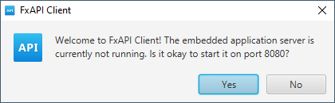
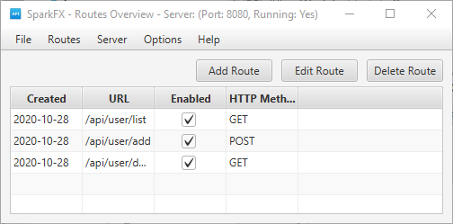
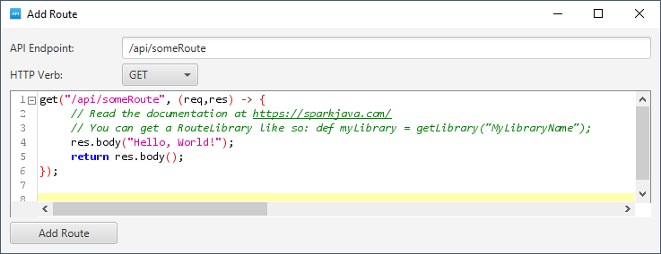

## SparkFX

SparkFX provides an easy to use JavaFX front end to the [Spark Java library](https://sparkjava.com/). Integrating
with this library lets us do really neat stuff. Our client provides an interface to dynamically create
API endpoints on your server while it's running, edit API logic, as well as remove endpoints.

All the above functionality can be done on the fly. No need to
reboot after making a small code change.

This is great for small microservices used within your company. It also provides one
centralized interface for a multiple endpoints, so no need to maintain multiple separate
web applications.

---

## Let's see some screenshots

When you first start the program, you'll be greeted by the below
prompt. You can click 'Yes' to accept the default port (8080) or
click 'No', and you can later specify which port to use.



Even though we haven't created any Routes yet, let's click 'Yes'. We can add routes
*dynamically* at runtime.

---

### Route Overview

This window allows us to add/edit/delete Routes, and much more.
See below, we've already created a few sample routes.



### Route Editor

A window will pop up with an editor where we can define the Route logic. We can use Java or Apache Groovy code
to define the Route logic. 



This Route is very simple, but mentions something you haven't seen yet, RouteLibraries. RouteLibraries are a way
for us to keep the code in our Route definitions from being overly verbose. Think of it as a separate Class file.

We can get a previously defined RouteLibrary by the following:

```groovy
    // Groovy Style
    def MyLibraryClass = getLibrary("MyLibraryClass")
    // or Java Style
    //Object MyLibraryClass = getLibrary("MyLibraryClass");

    // We can then call static or instance methods (since it is actually created with newInstance() in the background)
    MyLibraryClass.someInstanceMethod()
    MyLibraryClass.someStaticMethod()

    // It's best do do something like below where the name is lower camel-case if you're going
    // to primarily reference the instance instead of the static methods.
    def emp = getLibrary("Employee")
    emp.setSalary(new BigDecimal("45,000"))
    
    // While this is fine if you're going to use all static methods.
    def Printer = getLibrary("Printer")
    Printer.printAllTheThings()
```

As soon as we save our changes to this route, we can visit http://localhost:8080/api/someRoute and see the changes
we made instantly. No server reboot required!

---

### Route Library

Route Libraries can be accessed through the Routes menu.

We can then use a RouteLibrary in our code by calling ```getLibrary()```. Calling ```getLibrary("TestLibrary")``` 
would instantiate the library you see in the screenshot above. We can then call static and instance methods from the
library.

---

### Startup Scripts

Sometimes we want to run a piece of code during server startup. For this, we have "Startup Scripts". These pieces
of code (if they're enabled) will be run any time the server starts, before the Route definitions have been applied. 

We can get there from the "Server" menu up top. This is also where we could start/stop the server if needed.

We can enable/disable individual startup scripts, or even run them on demand.

---


### Where are my route definitions/code stored?

The program uses a single SQLite database to maintain this. By default, it's created in the same directory
as the application, but this can be overridden via the Options menu.

While the intended database is SQLite, SparkFX could easily be adapted to work with MySQL, MariaDB or similar..

---

### How to enable SSL/HTTPS

To enable SSL, create a Startup Script. Then call the spark.Spark.secure() method.
As example:

```groovy
import static spark.Spark.secure
secure("/path/to/keystore.jks", "password", null, null)
```

---


## Build

Simply build with Apache Maven to build an executable JAR
  1. Clone the repo
  2. `cd` into the directory
  3. Run `mvn clean package`
  4. Double click the JAR file in the target folder to run
  
  
To build a Windows EXE file
  1. Install launch4j
  2. Provide path to launch4j.exe in POM.xml
  3. In the exec plugin in POM.xml, change skip to false
  4. Run `mvn clean package`
  5. Find the SparkFX.exe in the `./target` directory

---

## Cross-platform execution

Tested on both Windows 10 and Linux (Ubuntu 20.04 LTS).
Should work fine on MacOS, but I rarely use it, so cannot guarantee stability.
Launch4j is used to build the Windows EXE file, if desired, enable the step in POM.xml

---

## Command line options

 - `--headless`
 
   Runs the app in headless mode, no GUI is started. All enabled Startup Scripts and Routes will be processed.
 
 - `--port xxxx`
 
   Runs Spark on the specified port. E.g. `--port 8080` will run the server on port 8080.

---

### What's the use case for SparkFX??

SparkFX is a great tool to use when developing software that relies on a REST API. We can create complex or simple
routes, see what works, what doesn't, and modify the logic all without restarting a server or re-deploying
a WAR file. It could probably even be used in a production scenario with a few tweaks. (Feel free to send pull requests).

---


# Thanks for visiting!

Feel free to contribute. If you enjoyed SparkFX, please give the repo a star. This helps me know what software
is worth maintaining, and which software should fade into oblivion.
